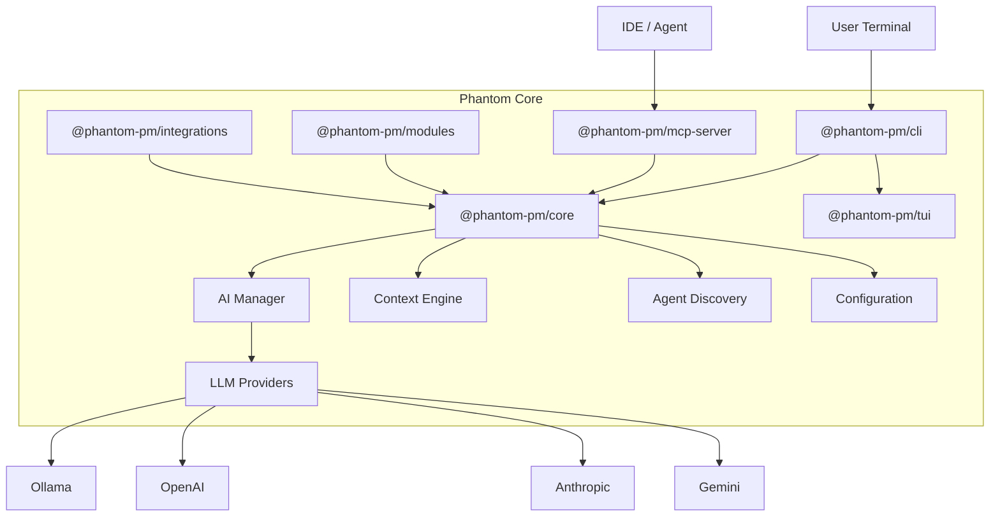

+++
title = "Architecture"
+++


Phantom is built as a modular monorepo with 6 packages. Each package has a single responsibility and communicates through well-defined TypeScript interfaces.

## System Diagram



## Package Overview

| Package | Purpose | Key Files |
|---------|---------|-----------|
| `@phantom-pm/core` | AI providers, config, context, discovery | `ai/manager.ts`, `config.ts`, `context.ts` |
| `@phantom-pm/cli` | Terminal interface, commands, chat REPL | `index.tsx`, `commands/chat.ts` |
| `@phantom-pm/mcp-server` | Model Context Protocol server | `index.ts`, `discovery.ts` |
| `@phantom-pm/tui` | Terminal UI components (Ink/React) | `screens/boot.ts`, `screens/swarm.ts` |
| `@phantom-pm/modules` | Functional plugins (PRD, Swarm, etc.) | `prd-forge.ts`, `swarm.ts` |
| `@phantom-pm/integrations` | External tool connectors | `github.ts` |

## AI Manager

The `AIManager` class is the central abstraction for LLM communication:

```typescript
class AIManager {
  providers: Map<ProviderType, BaseAIProvider>;
  defaultProvider: BaseAIProvider;
  fallbackChain: BaseAIProvider[];
  
  async complete(request: AIRequest): Promise<AIResponse>;
  async stream(request: AIRequest): Promise<StreamingAIResponse>;
}
```

**Key design decisions:**
- **Provider abstraction**: All providers implement `BaseAIProvider`, making it trivial to add new ones.
- **Automatic fallback**: If the primary provider fails, the manager tries the next in the chain.
- **Streaming-first**: The chat REPL uses `stream()` for real-time output.
- **Rate limiting**: Built-in per-provider rate limiting prevents API throttling.

## Data Storage

All data is stored locally in `~/.phantom/`:

```
~/.phantom/
├── config.json     # User configuration & API keys
├── brain/          # Project context and memory
└── modules/        # Installed module data
```

No data is sent to Phantom servers. All AI calls go directly from your machine to the provider API.

## Build System

- **TypeScript** throughout, compiled with `tsc`.
- **npm workspaces** for monorepo management.
- **esbuild** for release binary bundling.
- Dependencies flow: `core` → `mcp-server` / `modules` / `tui` → `cli`.
