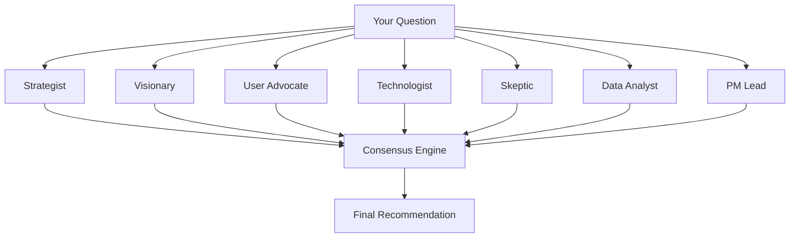

# Swarm Intelligence

Phantom's swarm mode simulates a room of expert product leaders debating a topic. Instead of relying on a single AI perspective, the swarm generates multi-perspective consensus.

## Usage

```bash
# From the terminal
phantom swarm "Should we pivot from freemium to enterprise sales?"

# From inside the chat REPL
phantom (ollama:llama3.1) ▸ /swarm Should we build an API or a UI-first product?
```

## How It Works

The swarm runs **7 virtual agents** in sequence, each with a distinct perspective:



### The Agents

| Agent | Role | Perspective |
|-------|------|-------------|
| **Strategist** | Market fit & business logic | Revenue, positioning, competitive dynamics |
| **Visionary** | Long-term impact | Innovation potential, market trends, 5-year horizon |
| **User Advocate** | Customer needs | UX, accessibility, user satisfaction, retention |
| **Technologist** | Feasibility | Engineering effort, tech debt, scalability |
| **Skeptic** | Risk analysis | What could go wrong, edge cases, failure modes |
| **Data Analyst** | Quantitative insight | Metrics, benchmarks, statistical reasoning |
| **PM Lead** | Synthesis | Combines all perspectives into a recommendation |

## Output Structure

The swarm produces a structured consensus report:

```
=== SWARM CONSENSUS REPORT ===

Question: "Should we add AI-powered search to our docs platform?"

┌─────────────────────────────────────────┐
│ STRATEGIST                              │
│ Score: 8/10 — Strong market demand      │
│ AI search is table-stakes for docs in   │
│ 2025. Competitors already have it.      │
├─────────────────────────────────────────┤
│ VISIONARY                               │
│ Score: 9/10 — High innovation potential │
│ This opens a path to AI-assisted        │
│ developer onboarding.                   │
├─────────────────────────────────────────┤
│ ... (all 7 agents)                      │
├─────────────────────────────────────────┤
│ CONSENSUS: BUILD (8.2/10 avg)           │
│ All agents agree this is high-priority. │
│ Ship as a beta within 2 sprints.        │
└─────────────────────────────────────────┘
```

## When to Use Swarm

| Use Case | Why Swarm Helps |
|----------|----------------|
| Feature prioritization | Get multiple perspectives before committing |
| Go/No-Go decisions | Identify risks you haven't considered |
| Strategic pivots | Stress-test major business decisions |
| Roadmap validation | Ensure your priorities are balanced |

## JSON Output

For programmatic use, add `--json`:

```bash
phantom swarm "Should we build mobile?" --json
```

This outputs structured JSON with each agent's score, reasoning, and the final consensus.
