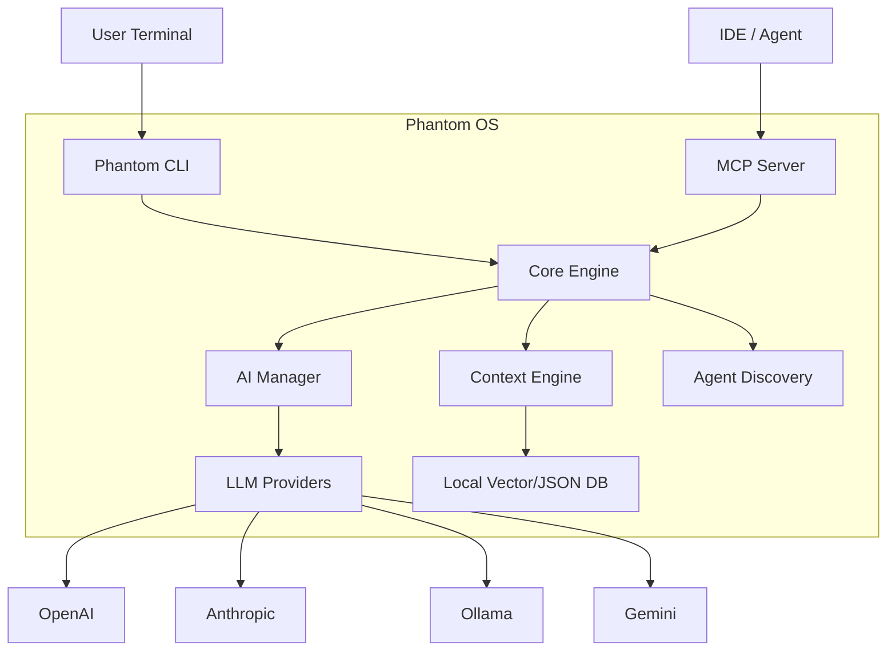

# Architecture

Phantom is built as a modular "Operating System" for Product Management, designed to run in the terminal and integrate with other tools via MCP.

## System Overview

## Key Components

### 1. Core Engine (`@phantom-pm/core`)
The brain. Handles:
- **AI Abstraction**: Unified interface for OpenAI, Anthropic, Gemini, Ollama.
- **Context Management**: Storing and retrieving project context.
- **Agent Orchestration**: Managing the "Swarm" of virtual agents.

### 2. CLI (`@phantom-pm/cli`)
The interface.
- Built with `commander` and `ink` (React for CLI).
- Handles user input, rendering TUI components, and streaming output.

### 3. MCP Server (`@phantom-pm/mcp-server`)
The bridge.
- Implements the [Model Context Protocol](https://modelcontextprotocol.io).
- Exposes Phantom tools (PRD gen, Swarm) to external agents like Claude Desktop and IDEs.

### 4. Modules (`@phantom-pm/modules`)
The plugins.
- Specific functional blocks like `prd-forge`, `story-writer`, `ux-auditor`.
- Can be installed/uninstalled to customize the OS.

## Data Storage

Phantom stores configuration and local context in `~/.phantom/` (or platform equivalent).
- `config.json`: User preferences & API keys.
- `brain/`: Project-specific context and memory.

## Security

- API keys are stored in the local config file (user-readable only).
- No data is sent to Phantom servers (there are no Phantom servers).
- All AI calls go directly from your machine to the provider API.
